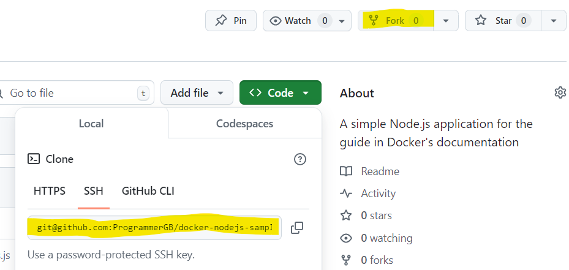
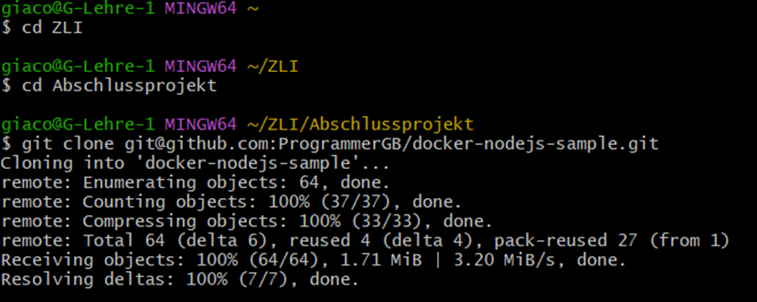
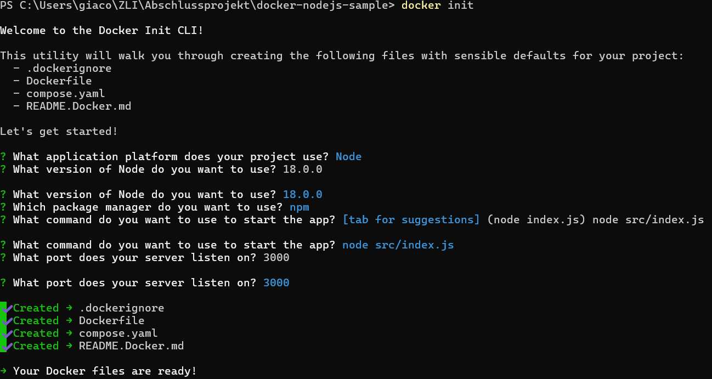

## Klonen Repositories

Als erstes muss man eine Fork auf meinen Github Akkount erstellt. 

Danach muss man in den gewünschten Ordner navigieren. Das macht man mit dem Befehl cd und dem Ordnernamen (siehe unten). Um das Repositories zu Klonen brauch man den SSH key den man in Git hub unter «Code» bekommt und dort kopieren kann.

## Installation der notwendigen Pakete
Bevor man ein Paket installiert, sollte die Authentifizierung bei GitHub Packages gemäss den Anweisungen eingerichtet sein. Verwende dafür ein persönliches Zugriffstoken (klassisch) mit GITHUB_TOKEN, um Pakete zu veröffentlichen, und die Berechtigung read:Packages, um Pakete aus anderen privaten Repositories zu installieren. Wichtig ist, dass die Anweisungen des verwendeten Paketclients genau beachtet werden, um eine fehlerfreie Installation zu gewährleisten.

## Docker-Konfiguration und -Installation
Um Docker Desktop auf Windows zu installieren, lädt man den Installer von der Docker-Website herunter. Bei der Installation muss man WSL 2 benutzen. Für die Installation brauch man Windows 10 oder 11 in der 64-Bit-Version, wobei mindestens 4 GB RAM und eine 64-Bit-CPU mit SLAT benötigt werden. Man aktiviert die WSL 2-Funktion in den Windows-Einstellungen, bevor man Docker installiert. Nach dem Herunterladen des Installers doppelklicke man darauf und folge den Anweisungen im Installationsassistenten. Nach der Installation kann man Docker Desktop starten und die Nutzungsbedingungen akzeptieren, um das Programm zu verwenden.

## Starten der Applikation in einem Docker-Container

Um die Applikation in einem Docker Container zu starten muss man ins ins Terminal gehen. Dort navigiert man mit cd zu dem gewünschten Ordner. Danach gibt man "docker init" ein. Dadurch wird einem einige Fragen über die Einstllungen des Containers gestellt die man beantworten muss um den Container zu konfigurieren.

Danach kann man in einem Browser "localhost:" + die Portnummer.
